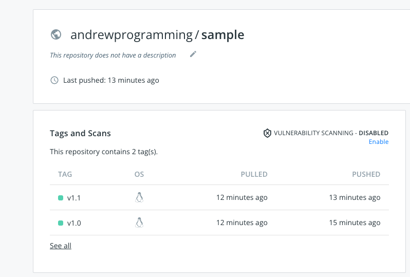
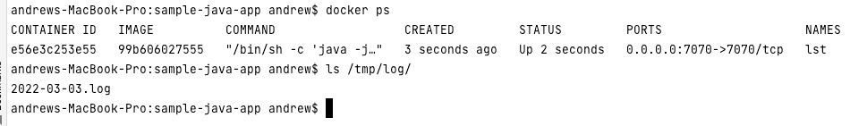
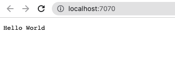

## How Andrew Do It
1. Build project with command ```mvn install ```
2. Create Dockerfile for build docker image
3. Build docker image with command ```docker build -t andrewprogramming/sample:v1.1 .```
4. Push docker image to Dockerhub **https://hub.docker.com/repository/docker/andrewprogramming/sample** 
   
  

5. Pull docker image from Dockerhub by running command: ```docker pull andrewprogramming/sample:v1.1```
6. Running docker container locally with command:```docker run -d -p 7070:7070 -v /tmp/log:/app1/logs --name=lst 99b606027555```
   
  
   
  